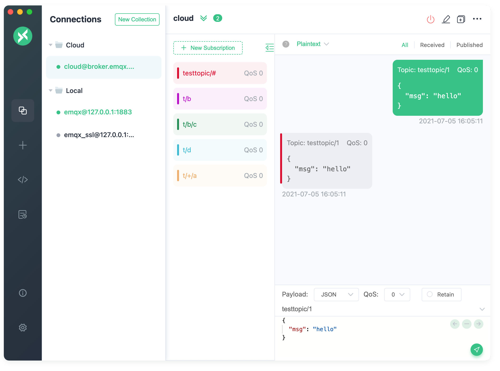

## 测试
EMQ 提供了一个后端 Web 控制台，用户可通过 Web 控制台，查看服务器运行状态、统计数据、客户端（Client）、会话（Session）、主题（Topic）、订阅（Subscription）、插件（Plugin）。

    访问地址：http://服务器IP:18083
    默认用户名：admin
    默认密码：public

### 使用MQTTX作为消息订阅的测试中台
[MQTTX安装](https://github.com/emqx/MQTTX)

```
  {
    "device": "controller",
    "sensorType": "Axis",
    "Value": [
      20,
      21,
      23
    ]
  }
```
