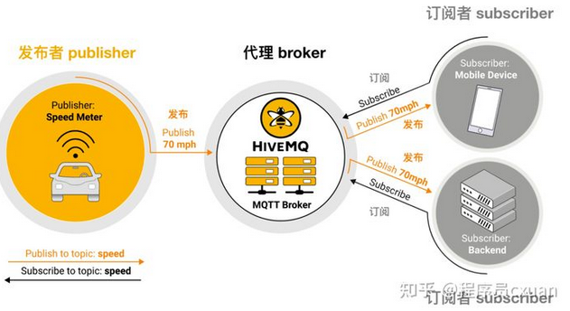
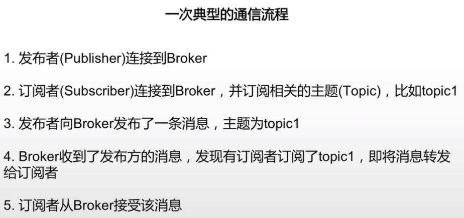

# MQTT
MQTT 协议的全称是 Message Queuing Telemetry Transport，翻译为消息队列传输探测，它是 ISO 标准下的一种基于发布 - 订阅模式的消息协议，它是基于 TCP/IP 协议簇的，它是为了改善网络设备硬件的性能和网络的性能来设计的。


## MQTT特点
服务器要能接成千上万个客户端；
每次消息传输的数据量不大；
协议客户端软件要能在CPU和存储等计算资源都很有限的单片机、单板机、RTU等上运行；并能方便的实现移植到不同的硬件上；

## mqtt抽象模型
传感器是publisher，移动段与服务器端是订阅者
### 1、发布到特定topic（url）
### 2、broker接收，check订阅者再发布



## MQTT Broker
### 特性
1、高可靠性
2、可集群化部署
3、安全性
### EMQX
broker
```sudo docker pull emqx/emqx:4.4.1```
```
docker run -d --name emqx -p 1883:1883 -p 8081:8081 -p 8083:8083 -p 8084:8084 -p 8883:8883 -p 18083:18083 emqx/emqx
```

## MQTT Client
每个client都需要有自己的id
其QOS类型需要保持与publisher一致

## QOS
Qos0（至多一次）发完就不管了、
Qos1（至少一次）发完要等待消息确认（但是有可能受到重放消息）、
Qos2（只有一次）发送消息后，检测broker的确认信息，随后才发送给订阅者
0-->1-->2 复杂度逐渐上升
**在工控环境可能需要使用Qos2**

## 场景复现
客户端：MQTT Explorer & MQTTX，需要有一个broker作为中间人
