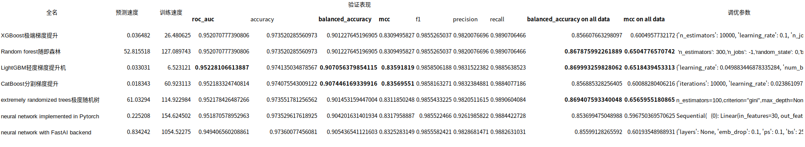

## Presets(模型复杂程度设置)

AutoGluon comes with a variety of presets that can be specified in the call to .fit via the presets argument. medium_quality is used by default to encourage initial prototyping, but for serious usage, the other presets should be used instead.

|Preset|Model Quality|Use Cases|Fit Time (Ideal)|Inference Time (Relative to medium_quality)|Disk Usage|
|--|-- |-- |--| -- |--|
|best_quality|State-of-the -art (SOTA), much better than high_quality |When accuracy is what matters|16x+|32x+|16x+|
|high_quality|Better than good_quality|When a very powerful, portable solution with fast inference is required: Large-scale batch inference|16x|4x|2x|
|good_quality	|Significantl y better than medium_quality|When a powerful, highly portable solution with very fast inference is required: Billion-scale batch inference, sub-100ms online-inference, edge-devices|16x|2x|0.1x|
|medium_quality|Competitive with other top AutoML Frameworks|Initial prototyping, establishing a performance baseline|1x|1x|1x|
We recommend users to start with medium_quality to get a sense of the problem and identify any data related issues. If medium_quality is taking too long to train, consider subsampling the training data during this prototyping phase.
Once you are comfortable, next try best_quality. Make sure to specify at least 16x the time_limit value as used in medium_quality. Once finished, you should have a very powerful solution that is often stronger than medium_quality.
Make sure to consider holding out test data that AutoGluon never sees during training to ensure that the models are performing as expected in terms of performance.
Once you evaluate both best_quality and medium_quality, check if either satisfies your needs. If neither do, consider trying high_quality and/or good_quality.
If none of the presets satisfy requirements, refer to Predicting Columns in a Table - In Depth for more advanced AutoGluon options.

### 运行机制
**tune hyperparameters**
tuning_data：加入自己定义的测试集
Model ensembling with stacking/bagging(num_bag_folds = 5-10, num_stack_levels = 1-3 in the call to fit(), but this will increase training times and memory/disk usage.此时不需要指定tuning data)

**early-stop iterative training**
**construct model ensembles**
      predictor.leaderboard(extra_info=True, silent=True)
查看分类器具体参数
      predictor.leaderboard(test_data, extra_metrics=['accuracy', 'balanced_accuracy', 'log_loss'], silent=True)
查看其他评价指标
#### Interpretability (feature importance)
      predictor.feature_importance(test_data)

# 多种分类器的表现
Stable model options include:
  - [x] 'GBM' (LightGBM)
  - [x]  'CAT' (CatBoost)
  - [x]  'XGB' (XGBoost)
  - [x]  'RF' (random forest)
  - [x]  'XT' (extremely randomized trees)
  - [x]  'KNN' (k-nearest neighbors)
  - [ ] ~~'LR' (linear regression)~~
  - [ ]  ~~'NN_MXNET' (neural network implemented in MXNet)~~
  - [x]  'NN_TORCH' (neural network implemented in Pytorch)
  - [x]  'FASTAI' (neural network with FastAI backend)

## xgb
经过超参数搜索得到最优参数（'num_trials': 5）
{'n_estimators': 10000, 'learning_rate': 0.17076151137021695, 'n_jobs': -1, 'proc.max_category_levels': 100, 'objective': 'binary:logistic', 'booster': 'gbtree', 'use_label_encoder': False, 'max_depth': 10, 'min_child_weight': 1, 'gamma': 1.84120769920274, 'subsample': 0.7307396811264659, 'colsample_bytree': 0.8240859360255985, 'reg_alpha': 9.78618342232764, 'reg_lambda': 7.9915856421672355}

## rf
'n_estimators': 300,
'n_jobs': -1,
'random_state': 0,
'bootstrap': True,

## LightGBM
{'learning_rate': 0.035179640321040824, 'num_leaves': 43, 'feature_fraction': 0.9479312595206661, 'min_data_in_leaf': 26, 'device': 'gpu'}

## cat
{'iterations': 10000, 'learning_rate': 0.05, 'random_seed': 0, 'allow_writing_files': False, 'eval_metric': 'Logloss', 'depth': 6, 'l2_leaf_reg': 3}

## XT
n_estimators=100,
*,
criterion="gini",
max_depth=None,
min_samples_split=2,
min_samples_leaf=1,
min_weight_fraction_leaf=0.0,
max_features="auto",
max_leaf_nodes=None,
min_impurity_decrease=0.0,
bootstrap=False,
oob_score=False,
n_jobs=None,
random_state=None,
verbose=0,
warm_start=False,
class_weight=None,
ccp_alpha=0.0,
max_samples=None,

##KNN
start_samples : int, default = 10000
            Number of samples to start with. This will be multiplied by sample_growth_factor after each model fit to determine the next number of samples.
            For example, if start_samples=10000, sample_growth_factor=2, then the number of samples per model fit would be [10000, 20000, 40000, 80000, ...]
        sample_growth_factor : float, default = 2
            The rate of growth in sample size between each model fit. If 2, then the sample size doubles after each fit.
        sample_time_growth_factor : float, default = 8

##  NN_TORCH
{'num_epochs': 5, 'epochs_wo_improve': 20, 'activation': 'tanh', 'embedding_size_factor': 1.0, 'embed_exponent': 0.56, 'max_embedding_dim': 100, 'y_range': None, 'y_range_extend': 0.05, 'dropout_prob': 0.07017539020632257, 'optimizer': 'adam', 'learning_rate': 0.0008855561236207109, 'weight_decay': 8.451994426336366e-05, 'proc.embed_min_categories': 100, 'proc.impute_strategy': 'mean', 'proc.max_category_levels': 200, 'proc.skew_threshold': 0.5, 'use_ngram_features': False, 'num_layers': 3, 'hidden_size': 512, 'max_batch_size': 512, 'use_batchnorm': False, 'loss_function': 'auto'}

## FASTAI
{'layers': None, 'emb_drop': 0.1, 'ps': 0.1, 'bs': 256, 'lr': 0.01, 'epochs': 30, 'early.stopping.min_delta': 0.0001, 'early.stopping.patience': 20, 'smoothing': 0.0}

