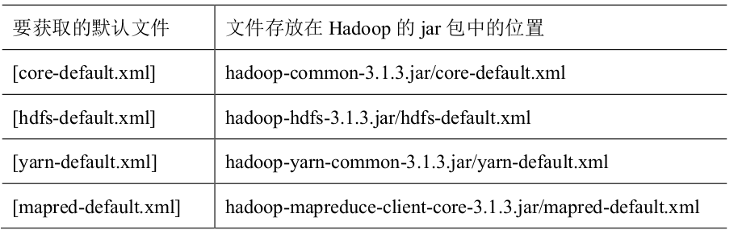

**etc/hosts**
192.168.0.133	wuguo-buaa
192.168.0.100	k
172.17.0.2	hadoop101
172.17.0.3	hadoop100

**core-site.xml**

      <?xml version="1.0" encoding="UTF-8"?>
      <?xml-stylesheet type="text/xsl" href="configuration.xsl"?>
      <!--
        Licensed under the Apache License, Version 2.0 (the "License");
        you may not use this file except in compliance with the License.
        You may obtain a copy of the License at

          http://www.apache.org/licenses/LICENSE-2.0

        Unless required by applicable law or agreed to in writing, software
        distributed under the License is distributed on an "AS IS" BASIS,
        WITHOUT WARRANTIES OR CONDITIONS OF ANY KIND, either express or implied.
        See the License for the specific language governing permissions and
        limitations under the License. See accompanying LICENSE file.
      -->

      <!-- Put site-specific property overrides in this file. -->

      <configuration>
        <!-- 指定 NameNode 的地址 -->
        <property>
          <name>fs.defaultFS</name>
          <value>hdfs://wuguo-buaa:8020</value>
        </property>
        <!-- 指定 hadoop 数据的存储目录 -->
        <property>
          <name>hadoop.tmp.dir</name>
          <value>/media/wuguo-buaa/LENOVO_USB_HDD/Software/hadoop-3.3.0/data</value>
          <!--value>/usr/local/hadoop-3.3.0/data</value -->
        </property>
        尚未配置
        <!-- 配置 HDFS 网页登录使用的静态用户为 atguigu -->
        /<property>
        /  <name>hadoop.http.staticuser.user</name>
        /  <value>wuguo-buaa</value>
        /</property>
      </configuration>

**hdfs-site.xml**

      <?xml version="1.0" encoding="UTF-8"?>
      <?xml-stylesheet type="text/xsl" href="configuration.xsl"?>
      <!--
        Licensed under the Apache License, Version 2.0 (the "License");
        you may not use this file except in compliance with the License.
        You may obtain a copy of the License at

          http://www.apache.org/licenses/LICENSE-2.0

        Unless required by applicable law or agreed to in writing, software
        distributed under the License is distributed on an "AS IS" BASIS,
        WITHOUT WARRANTIES OR CONDITIONS OF ANY KIND, either express or implied.
        See the License for the specific language governing permissions and
        limitations under the License. See accompanying LICENSE file.
      -->

      <!-- Put site-specific property overrides in this file. -->

      <configuration>
      <!-- nn web 端访问地址-->
      <property>
        <name>dfs.namenode.http-address</name>
        <value>wuguo-buaa:9870</value>
      </property>
      <!-- 2nn web 端访问地址-->
      <property>
        <name>dfs.namenode.secondary.http-address</name>
        <value>hadoop101:9868</value>
      </property>
      </configuration>

**yarn-site.xml**

      <?xml version="1.0"?>
      <!--
        Licensed under the Apache License, Version 2.0 (the "License");
        you may not use this file except in compliance with the License.
        You may obtain a copy of the License at

          http://www.apache.org/licenses/LICENSE-2.0

        Unless required by applicable law or agreed to in writing, software
        distributed under the License is distributed on an "AS IS" BASIS,
        WITHOUT WARRANTIES OR CONDITIONS OF ANY KIND, either express or implied.
        See the License for the specific language governing permissions and
        limitations under the License. See accompanying LICENSE file.
      -->
      <configuration>
      <!-- Site specific YARN configuration properties -->
      <!-- 指定 MR 走 shuffle -->
      <property>
        <name>yarn.nodemanager.aux-services</name>
        <value>mapreduce_shuffle</value>
      </property>
      <!-- 指定 ResourceManager 的地址-->
      <property>
        <name>yarn.resourcemanager.hostname</name>
        <value>hadoop100</value>
      </property>
      <!-- 环境变量的继承 -->
      <property>
        <name>yarn.nodemanager.env-whitelist</name>
        <value>JAVA_HOME,HADOOP_COMMON_HOME,HADOOP_HDFS_HOME,HADOOP_CONF_DIR,CLASSPATH_PREPEND_DISTCACHE,HADOOP_YARN_HOME,HADOOP_MAPRED_HOME</value>
      </property>
      </configuration>

**mapred-site.xml**

      <?xml version="1.0"?>
      <?xml-stylesheet type="text/xsl" href="configuration.xsl"?>
      <!--
        Licensed under the Apache License, Version 2.0 (the "License");
        you may not use this file except in compliance with the License.
        You may obtain a copy of the License at

          http://www.apache.org/licenses/LICENSE-2.0

        Unless required by applicable law or agreed to in writing, software
        distributed under the License is distributed on an "AS IS" BASIS,
        WITHOUT WARRANTIES OR CONDITIONS OF ANY KIND, either express or implied.
        See the License for the specific language governing permissions and
        limitations under the License. See accompanying LICENSE file.
      -->

      <!-- Put site-specific property overrides in this file. -->

      <configuration>
      <!-- 指定 MapReduce 程序运行在 Yarn 上 -->
      <property>
        <name>mapreduce.framework.name</name>
        <value>yarn</value>
      </property>
      </configuration>
**workers**
wuguo-buaa
hadoop100
hadoop101
k

## 第一次初始化的Version
wuguo-buaa@wuguo-buaa:/media/wuguo-buaa/LENOVO_USB_HDD/Software/hadoop-3.3.0/data/dfs/name/current$ cat VERSION
#Tue Apr 12 15:21:31 CST 2022
namespaceID=1226445920
clusterID=CID-408f896e-e16a-4e72-86b2-11274161d1c9
cTime=1649748091893
storageType=NAME_NODE
blockpoolID=BP-113505965-127.0.1.1-1649748091893
layoutVersion=-65

# 重新规划
**etc/hosts**
192.168.0.133	wuguo-buaa
192.168.0.100	k

**core-site.xml**

      <?xml version="1.0" encoding="UTF-8"?>
      <?xml-stylesheet type="text/xsl" href="configuration.xsl"?>
      <!--
        Licensed under the Apache License, Version 2.0 (the "License");
        you may not use this file except in compliance with the License.
        You may obtain a copy of the License at

          http://www.apache.org/licenses/LICENSE-2.0

        Unless required by applicable law or agreed to in writing, software
        distributed under the License is distributed on an "AS IS" BASIS,
        WITHOUT WARRANTIES OR CONDITIONS OF ANY KIND, either express or implied.
        See the License for the specific language governing permissions and
        limitations under the License. See accompanying LICENSE file.
      -->

      <!-- Put site-specific property overrides in this file. -->

      <configuration>
        <!-- 指定 NameNode 的地址 -->
        <property>
          <name>fs.defaultFS</name>
          <value>hdfs://wuguo-buaa:8020</value>
        </property>
        <!-- 指定 hadoop 数据的存储目录 -->
        <property>
          <name>hadoop.tmp.dir</name>
          <value>/media/wuguo-buaa/LENOVO_USB_HDD/Software/hadoop-3.3.0/data</value>
          <!--value>/usr/local/hadoop-3.3.0/data</value -->
        </property>
        尚未配置
        <!-- 配置 HDFS 网页登录使用的静态用户为 atguigu -->
        /<property>
        /  <name>hadoop.http.staticuser.user</name>
        /  <value>wuguo-buaa</value>
        /</property>
      </configuration>

**hdfs-site.xml**

      <?xml version="1.0" encoding="UTF-8"?>
      <?xml-stylesheet type="text/xsl" href="configuration.xsl"?>
      <!--
        Licensed under the Apache License, Version 2.0 (the "License");
        you may not use this file except in compliance with the License.
        You may obtain a copy of the License at

          http://www.apache.org/licenses/LICENSE-2.0

        Unless required by applicable law or agreed to in writing, software
        distributed under the License is distributed on an "AS IS" BASIS,
        WITHOUT WARRANTIES OR CONDITIONS OF ANY KIND, either express or implied.
        See the License for the specific language governing permissions and
        limitations under the License. See accompanying LICENSE file.
      -->

      <!-- Put site-specific property overrides in this file. -->

      <configuration>
      <!-- nn web 端访问地址-->
      <property>
        <name>dfs.namenode.http-address</name>
        <value>wuguo-buaa:9870</value>
      </property>
      <!-- 2nn web 端访问地址-->
      <property>
        <name>dfs.namenode.secondary.http-address</name>
        <value>k:9868</value>
      </property>
      </configuration>

**yarn-site.xml**

      <?xml version="1.0"?>
      <!--
        Licensed under the Apache License, Version 2.0 (the "License");
        you may not use this file except in compliance with the License.
        You may obtain a copy of the License at

          http://www.apache.org/licenses/LICENSE-2.0

        Unless required by applicable law or agreed to in writing, software
        distributed under the License is distributed on an "AS IS" BASIS,
        WITHOUT WARRANTIES OR CONDITIONS OF ANY KIND, either express or implied.
        See the License for the specific language governing permissions and
        limitations under the License. See accompanying LICENSE file.
      -->
      <configuration>
      <!-- Site specific YARN configuration properties -->
      <!-- 指定 MR 走 shuffle -->
      <property>
        <name>yarn.nodemanager.aux-services</name>
        <value>mapreduce_shuffle</value>
      </property>
      <!-- 指定 ResourceManager 的地址-->
      <property>
        <name>yarn.resourcemanager.hostname</name>
        <value>wuguo:buaa</value>
      </property>
      <!-- 环境变量的继承 -->
      <property>
        <name>yarn.nodemanager.env-whitelist</name>
        <value>JAVA_HOME,HADOOP_COMMON_HOME,HADOOP_HDFS_HOME,HADOOP_CONF_DIR,CLASSPATH_PREPEND_DISTCACHE,HADOOP_YARN_HOME,HADOOP_MAPRED_HOME</value>
      </property>
      </configuration>

**mapred-site.xml**

      <?xml version="1.0"?>
      <?xml-stylesheet type="text/xsl" href="configuration.xsl"?>
      <!--
        Licensed under the Apache License, Version 2.0 (the "License");
        you may not use this file except in compliance with the License.
        You may obtain a copy of the License at

          http://www.apache.org/licenses/LICENSE-2.0

        Unless required by applicable law or agreed to in writing, software
        distributed under the License is distributed on an "AS IS" BASIS,
        WITHOUT WARRANTIES OR CONDITIONS OF ANY KIND, either express or implied.
        See the License for the specific language governing permissions and
        limitations under the License. See accompanying LICENSE file.
      -->

      <!-- Put site-specific property overrides in this file. -->

      <configuration>
      <!-- 指定 MapReduce 程序运行在 Yarn 上 -->
      <property>
        <name>mapreduce.framework.name</name>
        <value>yarn</value>
      </property>
      </configuration>
**workers**
wuguo-buaa
k

## 第一次初始化的Version
wuguo-buaa@wuguo-buaa:/media/wuguo-buaa/LENOVO_USB_HDD/Software/hadoop-3.3.0/data/dfs/name/current$ cat VERSION
#Tue Apr 12 15:21:31 CST 2022
namespaceID=1226445920
clusterID=CID-408f896e-e16a-4e72-86b2-11274161d1c9
cTime=1649748091893
storageType=NAME_NODE
blockpoolID=BP-113505965-127.0.1.1-1649748091893
layoutVersion=-65
