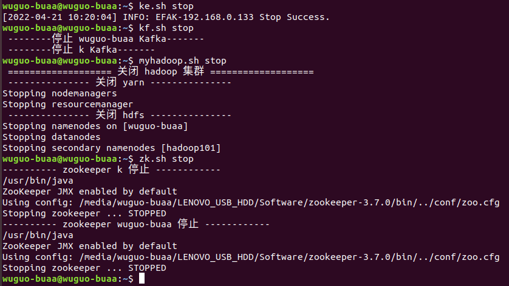

#centos8镜像
[Ubuntu安装centos docker](https://www.csdn.net/tags/NtDaAgysNzkxNS1ibG9n.html)
## docker镜像添加
#### 创建镜像
      docker pull centos:latest

此处使用本机的/media/wuguo-buaa/LENOVO_USB_HDD/Software目录为挂载点
给机器命名为hadoop

      docker run -it --name hadoop -v /media/wuguo-buaa/LENOVO_USB_HDD/Software:/usr/local/software centos:latest
#### 拷贝文件      
      mkdir /usr/local/bigdata
      cp -r /usr/local/software/hadoop-3.3.0 /usr/local/bigdata/
      cp -r /usr/local/software/jdk1.8.0_212 /usr/local/bigdata/

###下载工具(sshd)

[yum失败](https://blog.csdn.net/watson2017/article/details/122887710)

      yum install -y openssl openssh-server
      yum install openssh*

###创建密钥并启动ssh服务

      ssh-keygen -t rsa
      ssh-keygen -t dsa
      ssh-keygen -t ecdsa
      ssh-keygen -t ed25519
      cp ~/.ssh/id_rsa.pub ~/.ssh/authorized_keys

      修改sshd的配置文件

      vi /etc/ssh/sshd_config

      修改部分为

      ### 原内容
      HostKey /etc/ssh/ssh_host_rsa_key
      HostKey /etc/ssh/ssh_host_ecdsa_key
      HostKey /etc/ssh/ssh_host_ed25519_key
      ### 修改为
      HostKey /root/.ssh/id_rsa
      HostKey /root/.ssh/id_ecdsa
      HostKey /root/.ssh/id_ed25519
      HostKey /root/.ssh/id_dsa

      允许远程登陆

      vi /etc/pam.d/sshd
      # 使用#注释掉此行
      # account    required     pam_nologin.so

      启动sshd服务并查看状态

      /usr/sbin/sshd
      ps -ef | grep sshd

### 安装net-tools

      yum install net-tools

### 修改网络
      yum -y install NetworkManager
      vi /etc/sysconfig/network-scripts/ifcfg-ens3
      加入 IPADDR=172.17.0.3
      vi /etc/hostname
      hadoop100
**重启网络服务**systemctl restart NetworkManager
### 配置环境变量
      vi ~/.bashrc

      替换内容如下

      # .bashrc

      # Source global definitions
      if [ -f /etc/bashrc ]; then
              . /etc/bashrc
      fi

      # User specific environment
      if ! [[ "$PATH" =~ "$HOME/.local/bin:$HOME/bin:" ]]
      then
          PATH="$HOME/.local/bin:$HOME/bin:$PATH"
      fi

      export JAVA_HOME=/usr/local/bigdata/jdk1.8.0_212
      export CLASSPATH=$JAVA_HOME/lib
      export PATH=$PATH:$JAVA_HOME/bin

      # hadoop env
      export HADOOP_HOME=/media/wuguo-buaa/LENOVO_USB_HDD/Software/hadoop-3.3.0
      export HADOOP_COMMON_HOME=$HADOOP_HOME
      export PATH=$PATH:$HADOOP_HOME/bin

      PATH=$PATH:$HOME/bin
      export PATH

      # Uncomment the following line if you don't like systemctl's auto-paging feature:
      # export SYSTEMD_PAGER=

      # User specific aliases and functions

      :wq保存,更新环境变量

      source ~/.bash_profile

## 容器保存与复制
docker export 04da08d38dfd > hadoop_docker.tar
该docker被保存至/media/wuguo-buaa/LENOVO_USB_HDD/dockers_file
### 再开启一个新平台
//docker run -it --name hadoop101 -v /media/wuguo-buaa/LENOVO_USB_HDD/Software:/usr/local/software hadoop101:latest /bin/bash
docker run -itd --privileged -h hadoop100 --name hadoop100 -v /media/wuguo-buaa/LENOVO_USB_HDD/Software:/usr/local/software hadoop100:latest /usr/sbin/init
docker run -itd --privileged -h hadoop101 --name hadoop101 --ip=172.17.0.2 -v /etc/hosts:/etc/hosts hadoop101:latest /usr/sbin/init
docker run -itd --privileged -h hadoop100 --name hadoop100 --ip=172.17.0.3 -v /etc/hosts:/etc/hosts hadoop100:latest /usr/sbin/init
**带端口映射**
docker run -itd --privileged -h hadoop101 --name hadoop101 -p 1922:22 -p 12888:2888 -p 13888:3888 --ip=172.17.0.2 -v /etc/hosts:/etc/hosts hadoop101:latest /usr/sbin/init
docker run -itd --privileged -h hadoop100 --name hadoop100 -p 2022:22 -p 22888:2888 -p 23888:3888 --ip=172.17.0.3 -v /etc/hosts:/etc/hosts hadoop100:latest /usr/sbin/init
修改
IPADDR：172.17.0.2
和hostname为：hadoop101

## 再次开启设备
wuguo-buaa@wuguo-buaa:~$ docker start e95839f65cca
e95839f65cca

wuguo-buaa@wuguo-buaa:~$ docker exec -it e95839f65cca /bin/bash
#台式机
### ssh连接
确认另一台机器装有openssh-client与openssh-server
在本地～/.bashrc中添加别名k

      alias k="ssh root@192.168.0.100"

### 环境准备
[ubuntu20替换主机名称](https://blog.csdn.net/john1337/article/details/116304824)
[ubuntu18替换主机名称](https://www.cnblogs.com/qumogu/p/15257597.html)
**java**

      sudo mkdir /usr/lib/jvm

解压缩到该目录:

      sudo tar -zxvf jdk-8u212-linux-x64.tar.gz -C /usr/lib/jvm

1.修改环境变量:　　

      sudo gedit ~/.bashrc
在文件末尾追加下面内容：

      export JAVA_HOME=/usr/lib/jvm/jdk1.8.0_212 ## 这里要注意目录要换成自己解压的jdk 目录
      export JRE_HOME=${JAVA_HOME}/jre
      export CLASSPATH=.:${JAVA_HOME}/lib:${JRE_HOME}/lib
      export PATH=${JAVA_HOME}/bin:$PATH

使环境变量马上生效：

      source ~/.bashrc

2、系统注册此jdk

      sudo update-alternatives --install /usr/bin/java java /usr/lib/jvm/jdk1.8.0_212/bin/java 300

3、查看java版本，看看是否安装成功：

      java --version

## hadoop集群

**wuguo-buaa**
      sudo gedit ~/.bashrc
添加：

      # HADOOP_HOME
      export HADOOP_HOME=/media/wuguo-buaa/LENOVO_USB_HDD/Software/hadoop-3.3.0
      export PATH=$PATH:$HADOOP_HOME/bin
      export PATH=$PATH:$HADOOP_HOME/sbin

**k**

      export HADOOP_HOME=/usr/local/hadoop-3.3.0
      export PATH=$PATH:$HADOOP_HOME/bin
      export PATH=$PATH:$HADOOP_HOME/sbin

|设备名称 |wuguo-buaa | hadoop100|hadoop101| k |
|  ----  | ----  |  ----  |  ----  |  ----  |
|**HDFS** |NameNode， DataNode |DataNode |SecondaryNameNode，  DataNode | DataNode|
|**Yarn** |NodeManager  | NodeManager，  ResourceManager | NodeManager | NodeManager |
|**zk** | myid:2  |  myid:  | myid:  | myid:1 |
## zookeeper
**安装xsync**
在节点安装rsync
yum -y install rsync
在/usr/local/bin/xsync中写脚本

**集群部署规划**
|设备名称 |wuguo-buaa | hadoop100|hadoop101| k |
|  ----  | ----  |  ----  |  ----  |  ----  |
|**zk** | myid:2  |  ----- | -----  | myid:1 |
|**kafka** | kafka |  ----- | -----  | kafka |
**启动脚本**

      #!/bin/bash
      case $1 in
      "start"){
      	for i in k wuguo-buaa
      	do
      		echo ---------- zookeeper $i 启动 ------------
      		ssh $i "/media/wuguo-buaa/LENOVO_USB_HDD/Software/zookeeper-3.7.0/bin/zkServer.sh start"
      	done
      };;
      "stop"){
      	for i in k wuguo-buaa
      	do
      		echo ---------- zookeeper $i 停止 ------------
      		ssh $i "/media/wuguo-buaa/LENOVO_USB_HDD/Software/zookeeper-3.7.0/bin/zkServer.sh stop"
      	done
      };;
      "status"){
      	for i in k wuguo-buaa
      	do
      		echo ---------- zookeeper $i 状态 ------------
      		ssh $i "/media/wuguo-buaa/LENOVO_USB_HDD/Software/zookeeper-3.7.0/bin/zkServer.sh status"
      	done
      };;
      esac
**使用**
1)Zookeeper 集群启动脚本
 zk.sh start
2)Zookeeper 集群停止脚本
 zk.sh stop
 3）kafka-eagle
 ke.sh start
 ### 在spark使用前
 1）myhadoop.sh start
 2)
**zk client客户端**
 /media/wuguo-buaa/LENOVO_USB_HDD/Software/zookeeper-3.7.0$bin/zkCli.sh -server wuguo-buaa:2181

## kafka
（基于发布订阅模式，而不是生产消费模式【点对点】）
**编写kf.sh**
kf.sh start需要在zk.sh start之后，zk.sh stop需要在kf.sh stop之前
目前使用基于zookeeper版本
### kraft模式
kf2.sh start

kraft模式不能使用kafka-eagle
如果在kafka-eagle上删除topic需要输入**keadmin**这一token（存在kafka-eagle/conf中）

