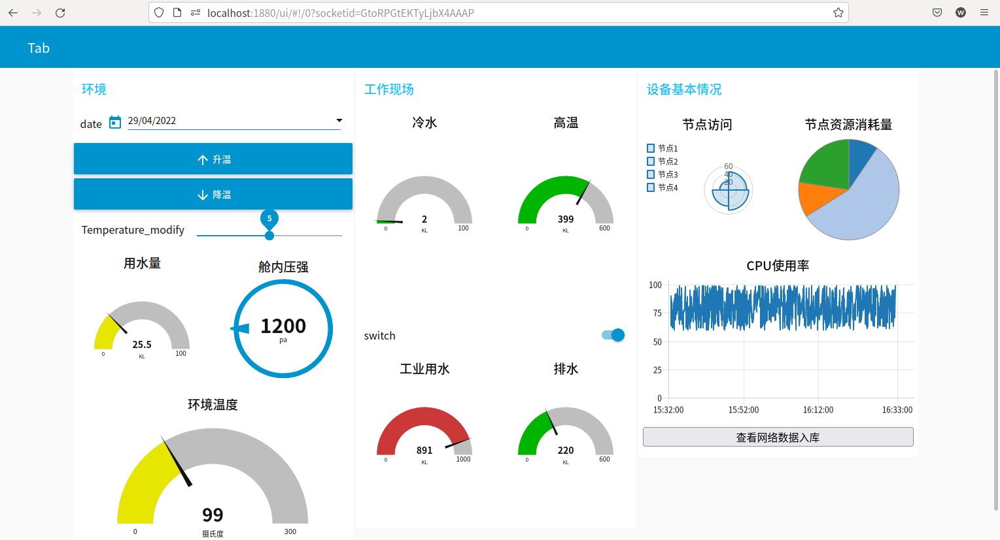
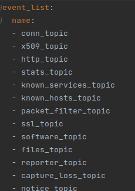
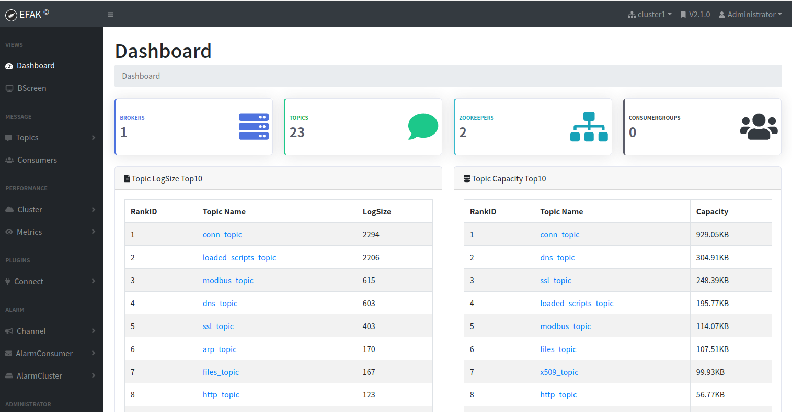
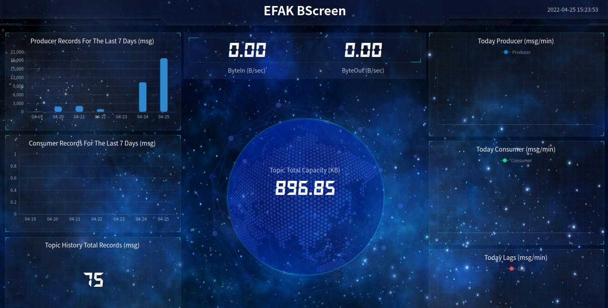
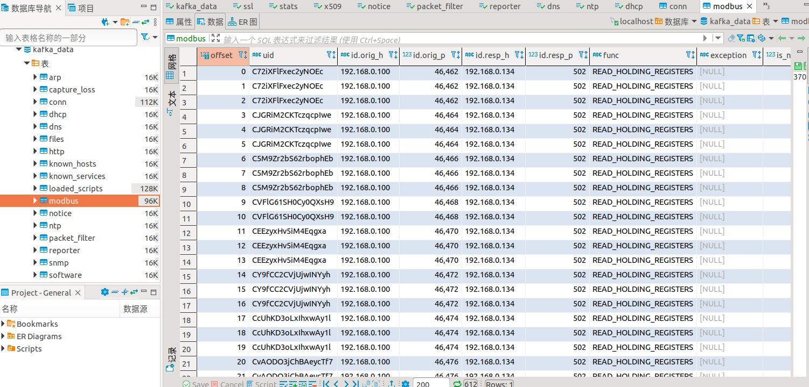
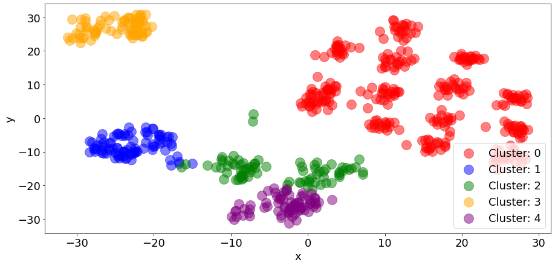
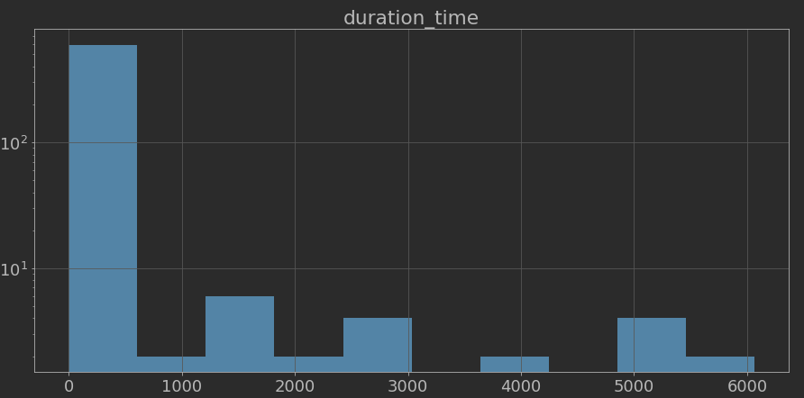
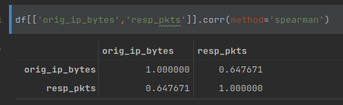

## 环境配置
底层设备：MQTT客户端（模拟MQTT设备）、ModbusTCP从站（模拟Modbus设备）

边缘侧：EMQX服务器（MQTT broker，监听MQTT设备的数据）、EdgeX Foundry的服务器（自动化进行数据采集、协议适配）、Kafka服务器+zookeeper集群环境（数据打包上云）、zeek数据解析服务器

云端：EMQX服务器（MQTT broker，用来向边缘侧下发指令）、Kafka服务器+zookeeper集群环境（获取边缘端的数据）、mysql数据库（消费kafka数据）、入侵检测框架（待实现）

云端监控

## kafka数据上云
**工作策略**
每一个边缘设备：Kafka生产者（上传处理后的边缘通讯数据）、Kafka消费者（边缘用户组、监听目前云端有哪些话题以实现新建话题，定期传输边缘端数据）
云端：Kafka消费者1（云端用户组、监听目前云端有哪些话题以实现新建数据库表）、Kafka消费者2（云端用户组、监听所有的网络事件话题，完成数据入库）、其他Kafka消费者（spark用户组、消费边缘端数据以实现其他分析工作、spark流处理）

在边缘端打开edgex foundry服务，底层设备自动进行连接与通讯，全部通讯数据被采集到边缘设备当中在zeek框架下进行分析处理不间断生成日志；在云端的指令下，日志内容会在备份后结构化传输到云端对应行为的话题下，同时日志会被回收以避免下次重复传输。如果不发送指令，边缘端也会在一定的时间间隔后自动同步数据到云端。

云端通过一个配置文件管理边缘端的行为，由其消费者不断接受边缘端的数据内容并将数据保存到数据库中，如果边缘端创建了新的行为，则新建话题并将该话题历史数据同步至数据库。

**
云端数据监控页面1
**

**
云端数据监控页面2
**

**
数据入库界面
**
## 云端数据处理
云端定期从sql数据库中提取结构化数据进行分析，包括以下几部分内容
### 数据预处理
不同行为的数据维度差异大且数据涵义不同，只能分别进行处理。
对于每一种行为数据，云端通过从mysql数据库中加载全部记录来获取原始的数据，使用scikit-learn框架进行数据预处理，包括：
1、数据的特征选取（根据经验删去一些无实意的字段以及id等标记字段）
2、特征映射为分类编码
3、分类数据删除空值
4、空值处理（数值类型）
5、完整性检查
6、数据标准化
7、数据类型转换
### 数据探查

**
通讯内容聚类
**

**
通讯时长分布
**

**
变量相关性分析
**
###
## 云端入侵检测
