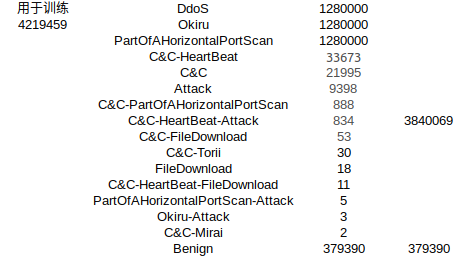
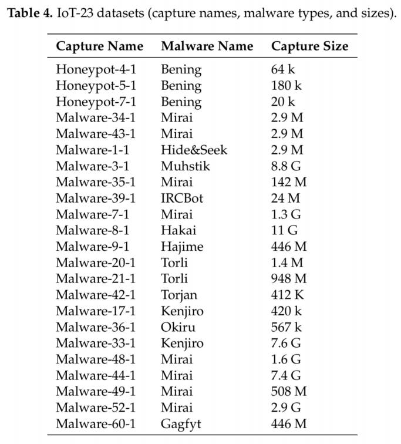
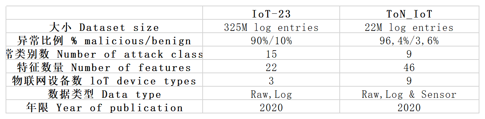

## 数据处理
将全部数据进行下采样，单类样本最大数量不超过12800个
C&C-HeartBeat,12800
C&C,12800
DDoS,12800
Okiru,12800
PartOfAHorizontalPortScan,12800
Attack,9398
C&C-PartOfAHorizontalPortScan,888
C&C-HeartBeat-Attack,834
C&C-FileDownload,53
C&C-Torii,30
FileDownload,18
C&C-HeartBeat-FileDownload,11
PartOfAHorizontalPortScan-Attack,5
Okiru-Attack,3
C&C-Mirai,2

**iot23的全部数据**

**Ton-iot的全部数据**

## 机器学习
**num_trials: 50（全部经过50次超参数调整来选取最优参数）**
|模型 |全名|工作参数 |验证表现 |调优参数  ||其他 |
|-- |-- |-- |-- |-- |-- |-- |  
|XGB  |XGBoost |pred_time_val :0.005237  fit_time :1.043780 |{'roc_auc': 0.9051299180112974, 'accuracy': 0.8674018555816027, 'balanced_accuracy': 0.8666211426800601, 'mcc': 0.7577251027554825, 'f1': 0.8477172758986804, 'precision': 0.9871070293182621, 'recall': 0.742822966507177} |{'n_estimators': 10000, 'learning_rate': 0.17076151137021695, 'n_jobs': -1, 'proc.max_category_levels': 100, 'objective': 'binary:logistic', 'booster': 'gbtree', 'use_label_encoder': False, 'max_depth': 10, 'min_child_weight': 1, 'gamma': 1.84120769920274, 'subsample': 0.7307396811264659, 'colsample_bytree': 0.8240859360255985, 'reg_alpha': 9.78618342232764, 'reg_lambda': 7.9915856421672355} | | |
| RF  |random forest | 2.223933  3.910291|    "roc_auc":0.9078832396305138,"accuracy":0.8570673886485951,"balanced_accuracy":0.8565192713238672,"mcc":0.7246394502001015,"f1":0.8425302826379543,"precision": 0.9307241019046854,"recall": 0.7696039340776183 | 'n_estimators': 300,'n_jobs': -1,'random_state': 0,'bootstrap': True, || |
| GBM| LightGBM|0.003738  0.589397 | "roc_auc": 1.0,"accuracy": 1.0,"balanced_accuracy": 1.0,"mcc": 1.0,"f1": 1.0,"precision": 1.0,"recall": 1.0|  {'learning_rate': 0.035179640321040824, 'num_leaves': 43, 'feature_fraction': 0.9479312595206661, 'min_data_in_leaf': 26, 'device': 'gpu'}|| |
|**CAT**|CatBoost |0.002340   5.411962 |    "roc_auc": 1.0,"accuracy": 1.0,"balanced_accuracy": 1.0,"mcc": 1.0,"f1": 1.0,"precision": 1.0,"recall": 1.0 | {'iterations': 10000, 'learning_rate': 0.05, 'random_seed': 0, 'allow_writing_files': False, 'eval_metric': 'Logloss', 'depth': 6, 'l2_leaf_reg': 3} || |
| XT  | extremely randomized trees |2.368959  2.919109 |    "roc_auc": 0.9092714194556419,"accuracy": 0.8579918777033051,"balanced_accuracy": 0.8574263060352681,"mcc": 0.7272379708066005,"f1": 0.8430692888678075,precision": 0.934784367667287,"recall": 0.7677432216905901 | n_estimators=100,criterion="gini",max_depth=None,min_samples_split=2,min_samples_leaf=1,min_weight_fraction_leaf=0.0,max_features="auto",max_leaf_nodes=None,min_impurity_decrease=0.0,|| |
| KNN|k-nearest neighbors |6.491899  0.235647 |    "roc_auc": 0.9035100627224022,"accuracy": 0.8588173143592961,"balanced_accuracy": 0.8582174179794637,"mcc": 0.7304086936186283,"f1": 0.8430364877762279,"precision": 0.9416926357224865,"recall": 0.7630914407230197 | start_samples : int, default = 10000,sample_growth_factor = 2,sample_time_growth_factor = 8 || |
| NN_TORCH |neural network implemented in Pytorch |0.025765   6.083100 |"roc_auc": 1.0,"accuracy": 1.0,"balanced_accuracy": 1.0,"mcc": 1.0,"f1": 1.0,"precision": 1.0,"recall": 1.0 | {'num_epochs': 5, 'epochs_wo_improve': 20, 'activation': 'tanh', 'embedding_size_factor': 1.0, 'embed_exponent': 0.56, 'max_embedding_dim': 100, 'y_range': None, 'y_range_extend': 0.05, 'dropout_prob': 0.07017539020632257, 'optimizer': 'adam', 'learning_rate': 0.0008855561236207109, 'weight_decay': 8.451994426336366e-05, 'proc.embed_min_categories': 100, 'proc.impute_strategy': 'mean', 'proc.max_category_levels': 200, 'proc.skew_threshold': 0.5, 'use_ngram_features': False, 'num_layers': 3, 'hidden_size': 512, 'max_batch_size': 512, 'use_batchnorm': False} || |
| FASTAI|neural network with FastAI backend |0.042012  49.856397 |    "roc_auc": 0.996462358360371,"accuracy": 0.5916729950143625,"balanced_accuracy": 0.5942123315938682,"mcc": 0.3169724410612372,"f1": 0.7081120630649766,"precision": 0.5490648219318472,"recall": 0.9968766613503456 | {'layers': None, 'emb_drop': 0.1, 'ps': 0.1, 'bs': 256, 'lr': 0.01, 'epochs': 30, 'early.stopping.min_delta': 0.0001, 'early.stopping.patience': 20, 'smoothing': 0.0} || |

## best parameter for ton-iot:
nn-best:
{'num_epochs': 50, 'epochs_wo_improve': 20, 'activation': 'elu', 'embedding_size_factor': 1.5, 'embed_exponent': 0.56, 'max_embedding_dim': 100, 'y_range': None, 'y_range_extend': 0.05, 'dropout_prob': 0.0, 'optimizer': 'adam', 'learning_rate': 0.0009692634970399649, 'weight_decay': 9.401548382548757e-08, 'proc.embed_min_categories': 10, 'proc.impute_strategy': 'mean', 'proc.max_category_levels': 400, 'proc.skew_threshold': 0.9, 'use_ngram_features': False, 'num_layers': 3, 'hidden_size': 256, 'max_batch_size': 512, 'use_batchnorm': True, 'loss_function': 'auto'}

LGBM-best:
{'learning_rate': 0.103335706015396, 'num_boost_round': 100, 'num_leaves': 62, 'feature_fraction': 0.842181292665241, 'min_data_in_leaf': 2}

XGb-best
{'n_estimators': 10000, 'learning_rate': 0.1, 'n_jobs': -1, 'proc.max_category_levels': 100, 'objective': 'binary:logistic', 'booster': 'gbtree', 'use_label_encoder': False, 'max_depth': 6, 'min_child_weight': 1, 'gamma': 0.01, 'subsample': 1.0, 'colsample_bytree': 1.0, 'reg_alpha': 0.0, 'reg_lambda': 1.0
