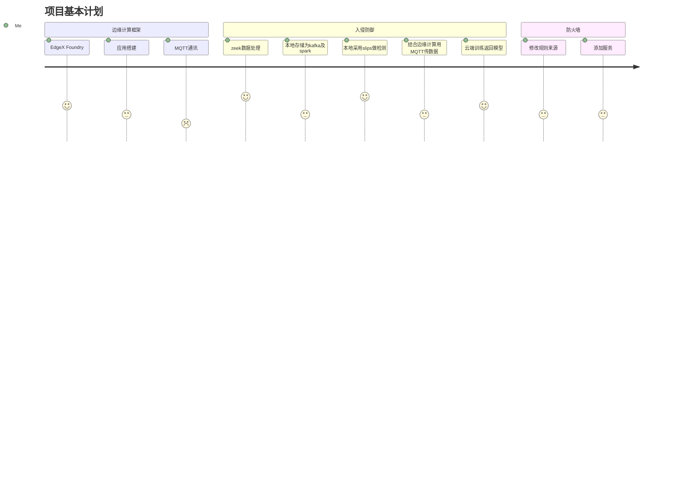

```mermaid
gantt
    dateFormat  YYYY-MM-DD
    title       下一代防火墙日程
    excludes    weekends
    %% (`excludes` accepts specific dates in YYYY-MM-DD format, days of the week ("sunday") or "weekends", but not the word "weekdays".)

    section 整体框架
    防火墙           :done,    des1, 2022-02-06,2022-03-08
    入侵检测框架               :active,  des2, 2022-02-09, 60d
    边缘计算框架               :active, des3,  2022-03-24, 15d
    框架结合              :         des4, after des3, 25d

    section 入侵防护
    （边缘端应用）Slips系统 :crit, done, 2022-02-11,35d
  （云端应用）tods          : active, after a2, 20d
    zeek分析入库kafka            :crit,a2,active, 15d
    spark处理推送        :crit, 5d
    云端数据入库，训练           :7d
    训练结果下发                     :3d
    入侵检测框架联调                :milestone,a3, 2022-04-25, 15d

    section 边缘计算
    EdgeX Foundry及应用搭建               :active,a1,  2022-03-25, 5d
    MQTT数据推送      : 2022-04-25,7d

    section 论文
    修改防火墙重投               :2022-03-25, 3d
    写与快速检测算法相关的文章      :2022-05-02,20d
  入侵防御系统文章    :2022-05-22,20d

```
EMQ X已经实现了 MQTT broker 与 Kafka的桥接。MQTT broker 用来快速的对大量物联网设备发来的消息做接收处理响应，而Kafka 对这些大量的数据做采集存储，交给数据分析人员来分析处理消息

目前正在进行的工作是：
安装docker
安装edgeX
在云服务器（台式机）安装EMQX服务器
在边缘设备（工控机）安装paho MQTT
研究把zeek入库（网上有疑似可以使用的工具）转化为kafka后持久化
