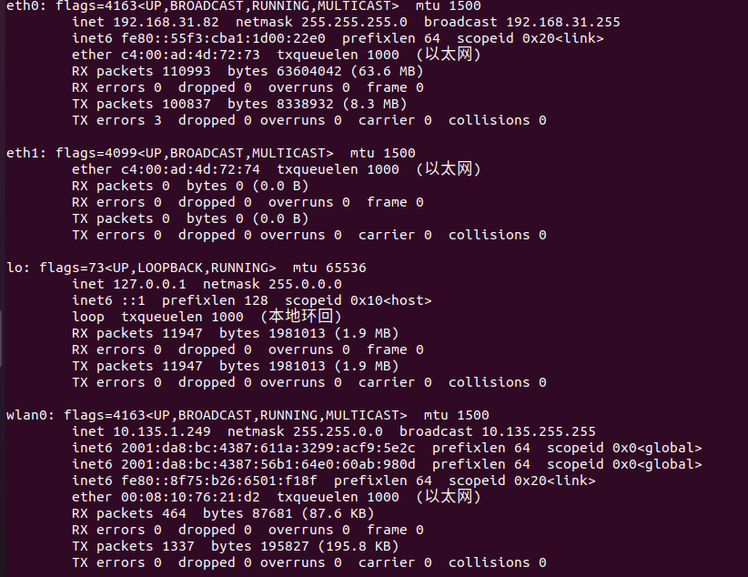
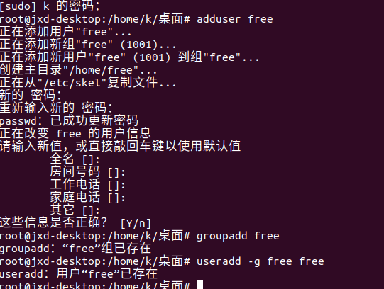
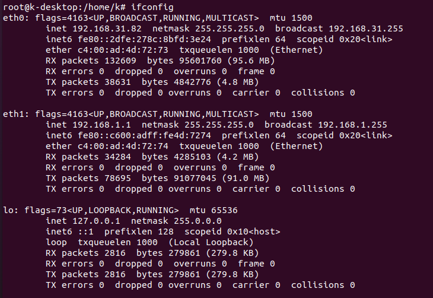
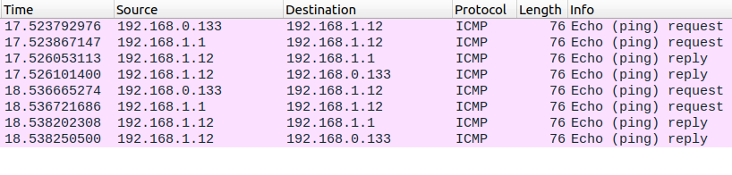
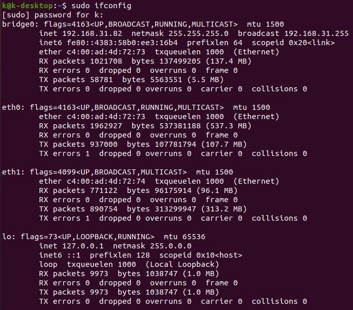
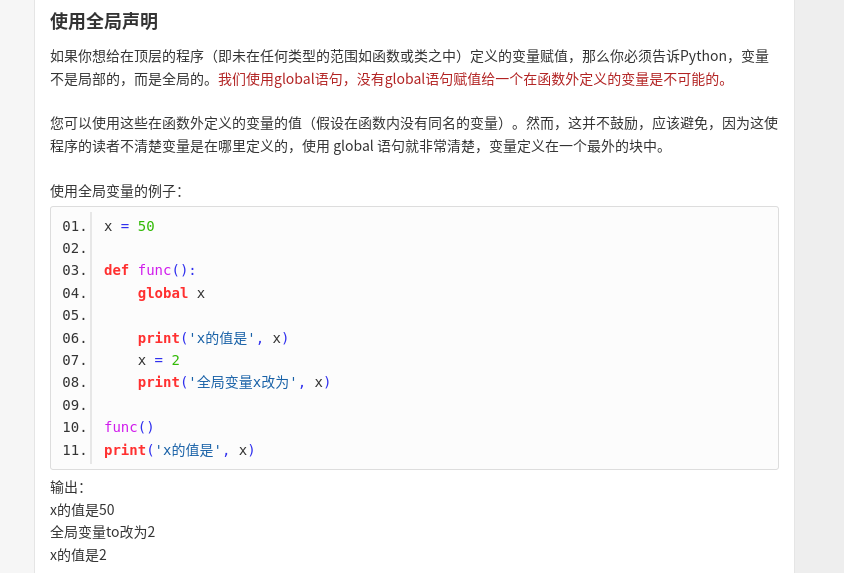

安装记录
postgre安装记录
sudo apt-get update
sudo apt-get install postgresql postgresql-client
安装完毕后，系统会创建一个数据库超级用户 postgres，密码为空。
```sudo -i -u postgres```


在pycharm中构造虚拟环境 PycharmProject/vene
修改data/config.json 和data/dhcp_server.json 为本机配置

"lan": {
    "ident": "eth0",
    "ip": "192.168.31.82",
    "netmask": "255.255.255.0",
    "subnet": "192.168.31.0/24"
安装必要依赖
使用cython编译得到netfilter.so以及binary_search.so


配置网络环境： 192.168.31.82安全增强装置，192.168.31.205上位机，192.168.31.1网关

在root下运行pycharm.sh以获得读取系统信息的权限。在etc/password下新建free的用户和free的用户组。
sudo apt-get install libtool 
sudo apt-get install libsysfs-dev
sudo apt-get install automake autoconf libtool
git clone git://git.netfilter.org/libnfnetlink
安装
autoreconf --install
autoconf
automake
./configure
make
sudo make install


aptitude install libnfnetlink0 libnfnetlink-dev

从官网下载libmnl
https://launchpad.net/ubuntu/+source/libmnl/1.0.4-3
解压tar -jxvf
cd
./configure
make
sudo make install

https://launchpad.net/ubuntu/+source/libnftnl/1.1.8-1
解压tar -jxvf
cd
./configure
make
sudo make install

从官网下载 libnetfilter_queue
```https://netfilter.org/projects/libnetfilter_queue/downloads.html
tar -jxvf libnetfilter_queue-1.0.5.tar.bz2
cd
./configure
make
sudo make install
```
至此系统依赖已经安装完成：
python3.7
python3-pip
postgresql
libpcre3 libpcre3-devpython3
libnetfilterqueue
python-netfilterqueue
python依赖为pg8000

将service文件夹文件全部复制到/lib/systemd/system以及/etc/systemd/system中
在安装过程中出现名称冲突的问题，pstats.py与pstats.pyi均存在，将usr/lib/python3.8/pstats.py修改为pstatts.py.

将源代码中所有dnx:dnx的部分替换为：k:k
COUNTRY NAME: CN
State or Province Name (full name) [Some-State]:BEIJING
Locality Name (eg, city) []:BUAA
Organization Name (eg, company) [Internet Widgits Pty Ltd]:BUAA
Organizational Unit Name (eg, section) []:FIREWALL
Common Name (e.g. server FQDN or YOUR name) []:WU
Email Address []:wuguobeijing@buaa.edu.cn

error:
moving dnx_web configuration to nginx
mv: 无法获取'/home/k/PycharmProjects/dnxfirewall/dnx_web' 的文件状态(stat): 没有那个文件或目录
-------------------------------------------------------------
iptables usage

python iptables实现了一个试图与底层C库紧密匹配的低级接口。模块iptc.简单通过提供一组丰富的高级函数来提高库的可用性，这些函数旨在简化与库的交互

eth0 connect to the WAN
eth1 connect to the LAN

为了设置网络共享，你需要在linux主机上更改一个内核参数来使能IP转发功能。内核启动参数设定在/etc/sysctl.conf文件中。打开这个文件，定位到含有# net.ipv4.ip_forward = 0的这一行，移除#号（即取消注释），然后将其值设置为1。
你还要使激活IP转发功能生效，通过执行下面的命令：
sysctl -w net.ipv4.ip_forward=1
sysctl -p
查看
iptables -L -t filter

iptables -X
iptables -F
iptables -t nat -X
iptables -t nat -F
iptables -F
iptables -P INPUT ACCEPT
iptables -P FORWARD ACCEPT
iptables -t nat -A POSTROUTING -o eth0 -j MASQUERADE #打开NAT
iptables -t nat -A POSTROUTING -s 192.168.1.12 -o eth0 -j SNAT --to 192.168.1.1
你的WAN口启用IP伪装功能
change the ipaddress and set the gateway to 192.168.1.1(eth1)

save
iptables-save > /etc/iptables.rules
change the dns to the same destination(192.168.31.1)


Kernel IP routing table
Destination     Gateway         Genmask         Flags Metric Ref    Use Iface
0.0.0.0         192.168.31.1    0.0.0.0         UG    100    0        0 eth0
0.0.0.0         192.168.1.1     0.0.0.0         UG    20101  0        0 eth1
169.254.0.0     0.0.0.0         255.255.0.0     U     1000   0        0 eth0
192.168.1.0     0.0.0.0         255.255.255.0   U     101    0        0 eth1
192.168.31.0    0.0.0.0         255.255.255.0   U     100    0        0 eth0


192.168.0.0|192.168.1.0
192.168.0.133  computer
192.168.0.100  eth0
192.168.1.1   eth1
192.168.1.12   controller

add a static route on the router 192.168.0.1
target:192.168.1.0
netmask:255.255.255.0
default gateway:192.168.0.100
interface:LAN
root@k-desktop:/home/k# iptables -t nat -A POSTROUTING -o eth0 -j MASQUERADE

root@k-desktop:/home/k# iptables -t nat -A POSTROUTING -s 192.168.0.0/24 -d 192.168.1.0/24 -j MASQUERADE

得到由上位机向控制器ping的结果：

可以看到上位机发出的ping请求控制器

after making a bridge between eth0 and eth1

## iptables

在代理服务器防火墙部署时，首先添加IPtables规则：
modbus poll 发往一个指定端口61122，从61122发往1080端口的防火墙服务器，最后转发到从站端口502
iptables -t nat -A PREROUTING -d 192.168.0.100 -p tcp --dport 61122 -j DNAT --to-destination 192.168.0.100:1080

modbus poll 发往一个指定端口502，从61122发往1080端口的防火墙服务器，最后转发到从站端口502。由主站首先发往502时进入时首先进入prerouting，在1080发往502时不经过prerouting。
sudo iptables -t nat -A PREROUTING -d 192.168.0.100 -p tcp --dport 502 -j DNAT --to-destination 192.168.0.100:1080
使用modpoll读：
cd wuguo-buaa:/media/wuguo-buaa/LENOVO_USB_HDD/Software/modpoll-3.10/modpoll
$ ./i686-linux-gnu/modpoll -m tcp -r 100 -c 5 192.168.0.100
使用modpoll写：
./i686-linux-gnu/modpoll -r 101 -c 1 192.168.0.100 12

由于linux系统限制，需要增加ulimit -n 81920
在测试时，可以开启modbus slave：
k@k-desktop:~/Downloads/diagslave-3.2/diagslave$ sudo linux_i386/diagslave -m tcp
代理测试
法一：
(base) root@k-desktop:/home/k/Downloads/modbus-proxy-master# modbus-proxy -b tcp://192.168.0.100:9000 --modbus tcp://192.168.1.12:502
法二：
(base) root@k-desktop:/home/k/Downloads/tcpproxy-master# ./tcpproxy.py -ti 192.168.1.12 -tp 502 -li 192.168.0.100 -lp 1080 -im hexdump:length=8

如果pycharm出现了打开新项目时崩溃的现象，打开setting，禁用markdown plugin插件即可

在 Python3 中，bytes 和 str 的互相转换方式是
str.encode('utf-8')
bytes.decode('utf-8')

安装suricata
sudo add-apt-repository ppa:oisf/suricata-stable
sudo apt update
sudo apt install suricata jq
在/etc/suricata/suricata.yaml当中设定了
HOME_NET 【192.168.0.0/24】
use-mmap: yes
tpacket-v3: yes


数据包处理过程
将数据包data处理为 result2，设定各类参数集合option1
for message in get_messages(option1 , result2):
    decoder.decode(message)

decode(message)：
self指的是Decoder
try:
    decoder.addToFrame(message) 	 	#将meesage添加到buffer
    if decoder.checkFrame():			#检查是否符合header的大小规格，长度是否遭到篡改
        unit = decoder._header.get("uid", 0x00) 		#确定uid
        decoder.advanceFrame() 		 	#把header清空，buffer清空
        decoder.processIncomingPacket(message, self.report, unit)
    else:
        self.check_errors(decoder, message)
except Exception as ex:
    self.check_errors(decoder, message)


上方processIncomingPacket(message, self.report, unit)
def processIncomingPacket(self, data, callback, unit, **kwargs):
self.addToFrame(data)				#再次将meesage添加到buffer
while True:
    if self.isFrameReady():			#同上检查
        if self.checkFrame():
            if self._validate_unit_id(unit, single):	#检查unit id
                self._process(callback)


   self._process(callback)
def _process(self, callback, error=False):
    """
    Process incoming packets irrespective error condition
    """
    data = self.getRawFrame() if error else self.getFrame() 	#buffer当中的载荷部分
    result = self.decoder.decode(data)			#这里是用的clientdecoder类中的decode方法
    if result is None:
        raise ModbusIOException("Unable to decode request")
    elif error and result.function_code < 0x80:
        raise InvalidMessageReceivedException(result)
    else:
        self.populateResult(result)				#为result添加pid、tid、uid
        self.advanceFrame()					#buffer清空
        callback(result)  # defer or push to a thread?		#完成对result的显示


Facory.py
def decode(self, message):
    """ Wrapper to decode a request packet

    :param message: The raw modbus request packet
    :return: The decoded modbus message or None if error
    """
    try:
        return self._helper(message)
    except ModbusException as er:
        _logger.warning("Unable to decode request %s" % er)
    return None


目前是针对server的decoder
https://www.runoob.com/python/file-methods.html
Python File(文件) 方法
open() 方法 以及所需要的参数说明


3月16日
## 设计软件界面
主界面包括一系列输入框，输入程序所需要的参数。输入框下方有一个添加规则按钮，每次添加就额外显示一行输入框，在输入框的最末尾有一个执行和停止按钮，分别代表运行带有这些参数的tcpproxy程序和停止程序。

在python程序中运行命令行语句并得到反馈
import subprocess

output = subprocess.check_output(['ls', '-1'])
print 'Have %d bytes in output' % len(output)
print output
推荐规则都包括：
NAT-POSTROUTING-MASQURADE
阻止forward
禁止ping操作

建立代理链接
白名单
黑名单

防止端口扫描
防止洪水攻击

丢弃fragments碎片
丢弃异常XMAS数据包
丢弃空数据包
丢弃null数据包
允许有限的TCP RST请求
丢弃无效数据包


https://blog.csdn.net/xyw_blog/article/details/10699795
tcpreplay安装


tshark -f"dst or src 192.168.0.133"

pycharm创建桌面图标：
https://www.cnblogs.com/holly-j/p/11762216.html

tsinghua ：pip install xxx -i https://pypi.tuna.tsinghua.edu.cn/simple
douban： pip install xxx -i http://pypi.douban.com/simple/

### Tods安装
目前有一份快照（Ubuntu tods）
多处tods文件夹内文件由data修改为_data，
关键字ANOMALY DETCTION不存在，修改为时间序列、
在windows安装miniconda和orange来创造图形界面，对应文件均在C：/windows/user/wuguo下

### Slids安装
https://stratospherelinuxips.readthedocs.io/en/develop/installation.html
需要注意把ubuntu的版本位修改为对应版本
echo 'deb http://download.opensuse.org/repositories/security:/zeek/xUbuntu_20.10/ /' | tee /etc/apt/sources.list.d/security:zeek.list
curl -fsSL http://download.opensuse.org/repositories/security:/zeek/xUbuntu_20.10/Release.key | gpg --dearmor | tee /etc/apt/trusted.gpg.d/security_zeek.gpg > /dev/null


配置源，安装python 3。8
安装显卡驱动及cuda、cudnn

**安装过程：
redis选用3.2.8,(教程说使用3。4。1，最好和python-redis版本一致)
node选用node16的稳定版LTS

apt-get update

apt-get -y install curl git python3-redis python3-pip python3-watchdog
python3 -m pip install --upgrade pip
pip3 install maxminddb colorama validators urllib3 numpy sklearn pandas certifi keras redis==3.4.1 slackclient stix2 cabby
pip3 install --ignore-installed six
随后安装redis（先下载）
https://download.redis.io/releases/
sudo make，sudo make install
**redis开启关闭：**
./redis-server 	/opt/redis/redis-3.2.8/redis.conf
##./redis-server --daemonize yes
./redis-server /media/wuguo-buaa/LENOVO_USB_HDD/redis-3.2.8/redis.conf
redis-cli shutdown
redis-cli -p 6379 shutdown
查看状态
sudo netstat -lntp | grep 6379
查看：
https://blog.csdn.net/panlee1991/article/details/82931582?spm=1001.2101.3001.6650.1&utm_medium=distribute.pc_relevant.none-task-blog-2%7Edefault%7ECTRLIST%7ERate-1.pc_relevant_aa&depth_1-utm_source=distribute.pc_relevant.none-task-blog-2%7Edefault%7ECTRLIST%7ERate-1.pc_relevant_aa&utm_relevant_index=1
**安装node 16**
安装包 sudo configure、make、make install
sudo npm install -g cnpm --registry=https://registry.npm.taobao.org
sudo ln -s /usr/software/nodejs/bin/cnpm /usr/local/bin
运行kalipso.sh时如果出现***is not a function则需要：
npm uninstall --save redis
cnpm install --save redis@3.2.8
此外在cnpm安装时chalk要安装4.1.2不能是默认的5.*.*


有时候Ubuntu自动更新会导致显卡驱动不可用，进入高级、恢复（recovery）启动模式
sudo apt-get install dkms
sudo dkms install -m nvidia -v 510.54（510.54表示的是驱动版本号）

在进行test-all过程中出现缺少nfdump环境的问题
apt-get install nss curl  git libtool m4 automake  bzip2-devel
但是nss找不到，于是查看源码下载
下载后nss需要安装以下两个依赖
* [gyp](https://gyp.gsrc.io/) 可以直接apt-get isntall
* [ninja](https://ninja-build.org/) 需要源码安装：
  [ninja] https://blog.csdn.net/qiuguolu1108/article/details/103842556

nfdump安装失败，不影响实际使用

**安装wireshark**
https://blog.csdn.net/cc_qjy/article/details/78819787

报错时：https://blog.csdn.net/wlmvp/article/details/85698038
两个依赖安装到了Dependents

## Slips实验：
开启redis服务：
./redis-server /media/wuguo-buaa/LENOVO_USB_HDD/redis-3.2.8/redis.conf
修改max_user_watches
https://www.cnblogs.com/jincon/p/3702545.html
在192.168.0.100上开启diagslave作为从站，在192.168.1.133上开启modpoll作为主站
### 1、正常流量和异常流量存入
label =
normal正常流量：modpoll对于100-104五个线圈的各种读操作以及对101线圈的写操作
malicious异常流量：modpoll对于100-104线圈以外的写操作
unknown未知流量：用于test
wireshark抓包可能导致所有经过接口的包都被捕获，需要使用tcpdump：
sudo tcpdump -i enp2s0 host 192.168.0.100 -w /media/wuguo-buaa/LENOVO_USB_HDD/Exp_data/modbus_test.pcap
若实验有误，清空数据库
进入./redis-cli			select 1			flushall
清华源下载tensorflow-gpu 2.1.0
**1、train_normal**
(venv) wuguo-buaa@wuguo-buaa:/media/wuguo-buaa/LENOVO_USB_HDD/PycharmProjects/StratosphereLinuxIPS$ ./slips.py -c slips.conf -f /media/wuguo-buaa/LENOVO_USB_HDD/Exp_data/modbus_normal.pcap
Slips. Version 0.8.3
https://stratosphereips.org

      [UpdateManager] Checking if we need to download TI files.
      …...

      Started main program [PID 17764]
      Started output thread [PID 17770]
                      Starting the module ARP (Detect ARP attacks) [PID 17873]
                      Starting the module flowmldetection (Train or test a Machine Learning model to detect malicious flows) [PID 17874]
                      Starting the module leak_detector (Detect leaks of data in the traffic) [PID 17876]
                      Starting the module portscandetector-1 (Detect Horizonal, Vertical and ICMP scans) [PID 17877]
                      Starting the module rnn-cc-detection-1 (Detect C&C channels based on behavioral letters) [PID 17878]
                      Starting the module timeline (Creates kalipso timeline of what happened in the network based on flows and available data) [PID 17879]
      Started logsfiles thread [PID 17881]
      [LogsProcess-8] Using the folder 2022-03-22--11-37-13 for storing results.
      Started Evidence thread [PID 17886]
      Started Profiler thread [PID 17887]
      Started input thread [PID 17888]

      [flowmldetection] Training the model with the last group of flows and labels. Total flows: 51.0.
      [flowmldetection] Training the model with the last group of flows and labels. Total flows: 101.0.
      [flowmldetection] Training the model with the last group of flows and labels. Total flows: 151.0.
      [flowmldetection] Training the model with the last group of flows and labels. Total flows: 201.0.
      [flowmldetection] Training the model with the last group of flows and labels. Total flows: 251.0.
      [flowmldetection] Training the model with the last group of flows and labels. Total flows: 301.0.:19)
      [flowmldetection] Training the model with the last group of flows and labels. Total flows: 351.0.
      [flowmldetection] Training the model with the last group of flows and labels. Total flows: 401.0.
      [input] We read everything. No more input. Stopping input process. Sent 849 lines022-03-22--11:37:44)
      Total Number of Profiles in DB so far: 1. Modified Profiles in the last TW: 0. (2022-03-22--11:38:09)

      Stopping Slips
              timeline                Stopped. 10 left.
              portscandetector-1      Stopped. 9 left.
              EvidenceProcess         Stopped. 8 left.
              ARP                     Stopped. 7 left.
              flowmldetection         Stopped. 6 left.
              OutputProcess           Killed.
              leak_detector           Already stopped.
              rnn-cc-detection-1      Already stopped.
              logsProcess             Killed.
              ProfilerProcess         Killed.
              inputProcess            Killed.
**2、train_malicious**
      首先设置slips.conf
      deletePrevdb = False
      label = malicious
      输入语句
---------------------------
Started main program [PID 18091]
Started output thread [PID 18097]
                Starting the module ARP (Detect ARP attacks) [PID 18195]
                Starting the module flowmldetection (Train or test a Machine Learning model to detect malicious flows) [PID 18196]
                Starting the module leak_detector (Detect leaks of data in the traffic) [PID 18198]
                Starting the module portscandetector-1 (Detect Horizonal, Vertical and ICMP scans) [PID 18199]
                Starting the module rnn-cc-detection-1 (Detect C&C channels based on behavioral letters) [PID 18200]
                Starting the module timeline (Creates kalipso timeline of what happened in the network based on flows and available data) [PID 18201]
Started logsfiles thread [PID 18203]
[LogsProcess-8] Using the folder 2022-03-22--11-48-41 for storing results.
Started Evidence thread [PID 18209]
Started Profiler thread [PID 18210]
Started input thread [PID 18211]

[flowmldetection] Training the model with the last group of flows and labels. Total flows: 451.0.
Total Number of Profiles in DB so far: 1. Modified Profiles in the last TW: 0. (2022-03-22--11:49:12)

Stopping Slips
        timeline                Stopped. 10 left.
        portscandetector-1      Stopped. 9 left.
        EvidenceProcess         Stopped. 8 left.
        flowmldetection         Stopped. 7 left.
        ARP                     Stopped. 6 left.
        OutputProcess           Killed.
        leak_detector           Already stopped.
        rnn-cc-detection-1      Already stopped.
        logsProcess             Killed.
        ProfilerProcess         Killed.
        inputProcess            Killed.

**disable all**
 disable = [template , ensembling , RiskIQ , blocking , http_analyzer , ThreatIntelligence1 , IP_Info , ExportingAlerts , UpdateManager , flowalerts , CESNET , virustotal , ARP , flowmldetection , leak_detector , portscanDetector , rnn-cc-detection-1 , timeline]
** disable all except ML**
disable = [template , ensembling , RiskIQ , blocking , http_analyzer , ThreatIntelligence1 , IP_Info , ExportingAlerts , UpdateManager , flowalerts , CESNET , virustotal , ARP , leak_detector , portscanDetector , rnn-cc-detection-1 , timeline]
**disable unmarked**
disable = [template , ensembling , template , RiskIQ , blocking , http_analyzer , ThreatIntelligence1 , IP_Info , ExportingAlerts , UpdateManager , flowalerts , CESNET , virustotal]
redis-cli shutdown
redis-cli -p 6379 shutdown
