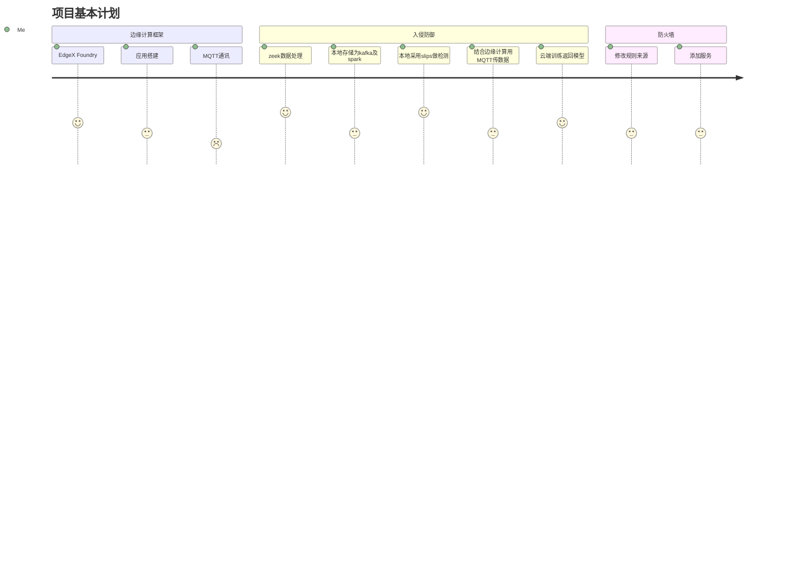

```mermaid
journey
    title 项目基本计划
    section 边缘计算框架
      EdgeX Foundry: 4: Me
     应用搭建: 3: Me
      MQTT通讯: 2: Me
      section 入侵防御
        zeek数据处理: 5: Me
      本地存储为kafka及spark: 3: Me
      本地采用slips做检测: 5: Me
      结合边缘计算用MQTT传数据: 3: Me
      云端训练返回模型: 4: Me
    section 防火墙
      修改规则来源: 3: Me
      添加服务: 3: Me
```
