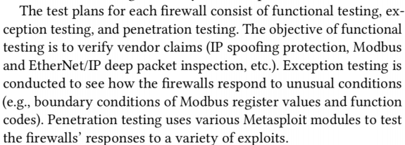
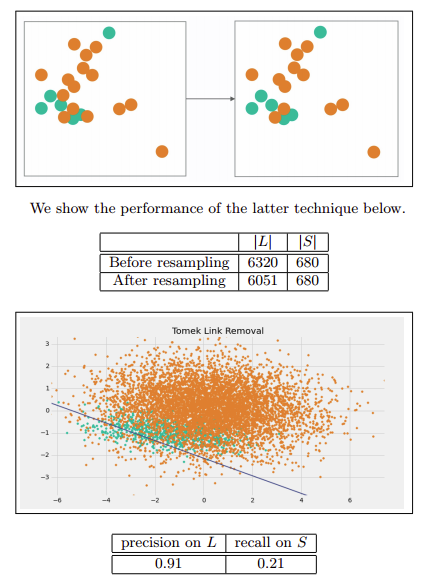

## 防火墙测试

缺陷假设法

测试内容

**功能测试**
防火墙给出的传统功能，包括dos防御、针对协议的传统攻击等
**异常测试**
特定协议功能码或内容
**渗透性测试**
arp毒化、栈溢出、ssh扫描
# zat
## Identifying, Modeling and Detecting Botnet Behaviors in the Network
botnets have become the technological backbone of a growing community of malicious activities
僵尸网络已经成为越来越多的恶意活动社区的技术支柱

The security research community has tackled the problem of detecting botnets from many perspectives, but most of them can be categorized inside two types: host-based detections and network-based detections. Among the host-based techniques are the traditional antivirus, antimalware and antispyware software that tried to detect the malicious binary files inside a computer. Among the network-based techniques are the IDS (Intrusion detection systems) and IPS (Intrusion prevention systems) that analyze the packets in the network. Both types of systems are meant for different purposesand usually complement each other. The most important advantage of the host-based techniques is that they can stop the infection before it occurs, and the most important advantage of the network-based methods is that they can protect a huge number of computers at the same time.
安全研究界已经从许多角度解决了检测僵尸网络的问题，但大多数防御可分为两类：基于主机的检测和基于网络的检测。基于主机的技术包括传统的防病毒、反恶意软件和反间谍软件，它们试图检测计算机内部的恶意二进制文件。基于网络的技术包括分析网络中数据包的IDS（入侵检测系统）和IPS（入侵防御系统）。这两种类型的系统用于不同的目的，通常是相辅相成的。基于主机的技术最重要的优点是可以在感染发生之前阻止感染，而基于网络的方法最重要的优点是可以同时保护大量计算机。

**C&C**：From 1999, the already known malware implements communication protocols that allow their owners to control all the infected computers at the same time. These mechanisms are called command and control channels (C&C).从1999年开始，已知的恶意软件实施通信协议，允许其所有者同时远程控制所有受感染的计算机。这些机制被称为命令和控制通道（C&amp;C）。

大部分恶意软件使用IRC通信作为中介，后来由于中心化的通信可能被防御，故改为借用P2P模式通渠道来传播。后来为了维持一种C&C通道，又改为借助http协议来隐藏自身，同时借助http所在的服务器作为自身的基础设施。

Botnets take control of the victims using several different mechanisms. The most common infection vector in the past years has been the drive-by-download [25], a method where the victim has to download (willing or not) a piece of malware that is then executed in her computer. Usually this means malware coming in an email or most probably malware being downloaded by accessing an infected web site. Once this first malware is installed, the botnets start a chain of updates and installations to leave the victim computer ready for usage. The goals of the updates are to install certain malware modules that are needed for operation, like new C&C channels, SPAM modules, DDoS modules, among others. These modules are usually bought from third-party malware developers, since it is difficult for one botmaster to develop all the parts of the botnet itself. Once the botnet is working and active, the control of the victim is done using a C&C channel
僵尸网络通过几种不同的机制控制受害者。在过去几年中，最常见的感染媒介是“驱动式下载”（drive by download），一种受害者必须下载（愿意或不愿意）一段恶意软件，然后在其计算机上执行的方法。通常这意味着恶意软件通过电子邮件发送，或者很可能通过访问受感染的网站下载。一旦安装了第一个恶意软件，僵尸网络就会启动一系列更新和安装，让受害计算机随时可用。更新的目标是安装运行所需的某些恶意软件模块，如新的C&amp;C通道、垃圾邮件模块、DDoS模块等。这些模块通常从第三方恶意软件开发人员处购买，因为一个僵尸主机很难开发僵尸网络本身的所有部分。一旦僵尸网络工作并处于活动状态，就可以通过C&amp;C渠道控制受害者

**implement a behavioral-based botnet detectionmethod by analyzing the network traffic.**
•通过分析真实流量来了解僵尸网络的行为。
•将结果与其他方法进行比较；包括一种新的比较方法和一种新的误差度量。
### 三种方法：
1、SimDetect
little time window，separate the traffic and then clusters certain features.

  we separate the flows in one second time windows, and then we
aggregate for each time window the following features: amount of different source IP addresses (sips), amount of different destinations IP contacted (dips), amount of different source ports used (sports) and amount of different destination ports contacted (dports). Then, we end up with a single register having four numbers per each time window.

2、BClus
bigger time windows

then to aggregate the traffic of each host separately instead of all the IP addresses together, then to compute some features of the aggregated data and then to clusterize the aggregated information searching for similar groups of behavior. Each cluster, unlike the previous approach, contains the behavior of each IP address. To automatically detect the clusters that represent a botnet behavior, we extracted a new group of features for each cluster and then we trained a rule-based classification algorithm to learn how to find those clusters.
然后分别聚合每个主机的流量，而不是将所有IP地址聚合在一起，然后计算聚合数据的一些特征，然后将聚合信息聚集起来，搜索类似的行为组。与前面的方法不同，每个集群都包含每个IP地址的行为。为了自动检测代表僵尸网络行为的集群，我们为每个集群提取了一组新的特征，然后我们训练了一个基于规则的分类算法来学习如何找到这些集群。

以两分钟为一个时间窗口，1分钟为一个聚合窗口，即每个时间窗口得到两段内容，每一段的其中一个源ip包含以下几个字段

hypothesize that these behaviors are generated from different probabilistic models and that the parameters of these models can be found using the EM algorithm.
文章假设不同的攻击行为遵循不同的概率模型，并且可以使用EM算法找到这些模型的参数。
在聚类之后得到每个类别的如下参数：
1. Total number of instances in the cluster.
2. Total number of NetFlows in the cluster.
3. Number of source IP addresses.
4. Average number of unique source ports.
5. Standard Deviation of the number of unique source ports.
6. Average number of unique destination IP addresses.
7. Standard Deviation of the number of unique destination IP addresses.
8. Average number of unique destination ports.
9. Standard Deviation of the number of unique destination ports.
10. Average number of NetFlows.
11. Standard Deviation of the number of NetFlows.
12. Average number of bytes transferred.
13. Standard Deviation of the number of bytes transferred.
14. Average number of packets transferred.
15. Standard Deviation of the number of packets transferred.

总体的流程如下：（leave-one-out）
#### 训练阶段（每一轮）
(a) Separate the NetFlows in time windows. (Subsection 4.2.1)
(b) Aggregate the NetFlows by source IP address. (Subsection 4.2.2)
(c) Cluster the aggregated NetFlows. (Subsection 4.2.3).
(d) Assign ground-truth labels to the clusters based on the ground-truth labels
of the NetFlows. (Subsection 4.2.4.1).
(e) Train a JRIP classification model to recognize the botnet clusters.
(f) Apply the JRIP model in the cross-validation dataset of this round.
(g) Store the error metrics of this round.

#### 验证阶段
` Select the best JRIP model based on the results of the leave-one-out.`
(a) Read the testing dataset.
(b) Use the best JRIP classification model to recognize the botnet clusters.
(c) Assign the labels to the NetFlows based on the labels of the clusters.
(d) Calculate the final error metrics.

把该方法和其他网络上的方法进行了对比，自己定义了新的对比维度：不使用传统的针对流的分类准确率来做评判，而是使用针对ip分类的准确率以及时间窗口来做加权。

3、CCDetector
上述两种，模式仍然存在不足，这种方法希望把流量当中的state变量也作为建模的重要参数。
First, it models the traffic using the changes in the states of the connections. Second, it represents these models with a Markov Chain that is used for detecting and finding similar traffic in
a new network.
首先，它使用state的变化对流量进行建模,获得流量的周期性。其次，它用马尔可夫链表示这些模型，马尔可夫链用于检测和发现新网络中的类似流量。

## An empirical comparison of botnet detection methods
本文是上一篇文章的延续，首先介绍了我们所使用的数据集，并且对多种已知的僵尸网络检测方法在数据集的每一个场景下的测试表现进行了对比，

## Ensembling to improve infected hosts detection
把集成学习和slips系统进行结合，综合多种分类器来进行ML模块的训练（基本得出基分类器效果很好的情况下集成学习反而会降低准确率）

# IOT using iot-dataset
## 2020-A deep learning ensemble for network anomaly and cyber-attack detection
### 知识点： 不平衡数据集分类
记多数类的样本集合为L，少数类的样本集合为S。
用r=|S|/|L|表示少数类与多数类的比例
##### baseline-logestic regression

##### Weighted loss function
在python的scikit-learn中我们可以使用class_weight参数来设置权重。

#### 欠采样方法(undersampling)
##### Random undersampling of majority class

##### Edited Nearest Neighbor (ENN)
我们将那些L类的样本，如果他的大部分k近邻样本都跟他自己本身的类别不一样，我们就将他删除。

ENN可以迭代进行，直到无法删除为止
##### Tomek Link Removal
如果有两个不同类别的样本，它们的最近邻都是对方，也就是A的最近邻是B，B的最近邻是A，那么A,B就是Tomek link。我们要做的就是讲所有Tomek link都删除掉。那么一个删除Tomek link的方法就是，将组成Tomek link的两个样本，如果有一个属于多数类样本，就将该多数类样本删除掉。

#### 过采样方法(Oversampling)
##### Random oversampling of minority class有放回抽样

##### Synthetic Minority Oversampling Technique(SMOTE)
For each point p in S：
1. 计算点p在S中的k个最近邻
2. 有放回地随机抽取R≤k个邻居
3. 对这R个点，每一个点与点p可以组成一条直线，然后在这条直线上随机取一个点，就产生了一个新的样本，一共可以这样做从而产生R个新的点。
4.  将这些新的点加入S中

R=1

##### Borderline-SMOTE1
For each point p in S:
    1. 计算点p在训练集T上的m个最近邻。我们称这个集合为Mp然后设 m'= |Mp ∩ L| (表示点p的最近邻中属于L的数量).
    2. If m'= m, p 是一个噪声,不做任何操作.
    3. If 0 ≤m'≤m/2, 则说明p很安全，不做任何操作.
    4. If m/2 ≤ m'≤ m, 那么点p就很危险了，我们需要在这个点附近生成一些新的少数类点，所以我们把它加入到DANGER中.
最后，对于每个在DANGER中的点d，使用SMOTE算法生成新的样本.

##### SMOTE + ENN 集成方法

### 正文
分为两部分处理训练：
1、数据增强与处理：**SMOTE + ENN</fontcolor>** **Deep Spare AE **
①特征选择
最大值替换无穷大、缺省值使用平均数、删除无用特征
②特征归一化
③数据均衡：SMOTE + ENN

数据集：

2、基础模型设计与训练
**DNN**:
**LSTM**:
3、stacking训练（iot-23）

## Machine learning approaches to IoT security_ A systematic literature review
提出了6个与loT安全性和机器学习相关的研究问题。随着大规模物联网攻击的快速增长，开发能够集成来自大数据和机器学习的最新技术和技术的模型非常重要。准确性和效率是寻找实时或近实时的检测loT攻击的关键质量因素
### 攻击类型
1、僵尸网络
C&C服务器可以进行各类攻击
2、洪漫攻击。UDP洪水攻击，其中UDP数据报发生洪水并堵塞网络。ICMP洪水是另一种攻击，即连续的ping数据包被发送到目标，而不等待响应。
3、TCP-SYN洪水攻击
攻击者将重复的SYN数据包发送到目的地上的多个端口。在目标使用SYN-ACK响应SYN请求后，源从未回复预期的ACK消息，导致目标继续等待回复，直到其连接限制溢出
4、死亡ping
攻击者通过向目的地发送多个畸形的大数据包片段，违反了65,535字节的最大包大小限制
5、HTTP-DDoS
向目标Web服务器打开许多HTTP连接。通过发送部分和连续的HTTP请求，这些连接保持无限期的开放状态。目标web服务器保持连接打开，并慢慢地其资源开始耗尽，直到它们完全耗尽
6、阻塞攻击
通过中断数据传输和反复重新传输来快速耗尽设备的电池电量。
7、放大攻击
通过利用协议中的漏洞和欺骗源IP地址来发起这些攻击。放大攻击的例子包括DNS扩增、UDP放大和ICMP放大攻击。
