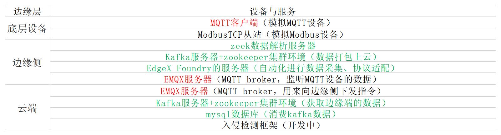

# 项目现状
## 项目组件
底层设备：MQTT客户端（模拟MQTT设备）、ModbusTCP从站（模拟Modbus设备）

边缘侧：EMQX服务器（MQTT broker，监听MQTT设备的数据）、EdgeX Foundry的服务器（自动化进行数据采集、协议适配）、Kafka服务器+zookeeper集群环境（数据打包上云）、zeek数据解析服务器、模型收发工具、防火墙

云端：~~EMQX服务器（MQTT broker，用来向边缘侧下发指令）~~、Kafka服务器（kafka、ke）+zookeeper集群环境（获取边缘端的数据）、mysql数据库（消费kafka数据）、入侵检测框架:AutoGL（二分类、多分类）、模型收发工具、node-red展示控制界面

实验拓扑

## 项目运行逻辑
### 业务
1、边缘端：
打开EMQX服务器

    docker ps -a
    docker start xxxxx

打开EdgeX的docker compose服务

    cd /home/wuguo-buaa/PycharmProjects/edgex-compose-v1
    docker compose start
    (如果服务退出则使用docker start xxxxx)

2、设备：
打开modbus从站设备

打开MQTT消费者（main.py）

3、云端：
开启zookeeper集群

    zk.sh start

开启kafka服务

    kf.sh start

开启kafka eagle监控

    ke.sh start

打开node-red服务

    node-red
    192.168.0.1:1880/ui

### 安全服务
边缘端：
打开Slips-dev软件与模型收发服务

    in terminal:./slips.py -c slips.conf -f /home/wuguo-buaa/exp-packet/normal_cap.pcap

    运行/home/wuguo-buaa/PycharmProjects/StratosphereLinuxIPS-dev/new_model.py

打开防火墙软件

    用户名密码：123

云端：
打开IOT23入侵检测系统模型收发程序

    运行receive_parquet_train.py

### 工作流程
打开

## 项目问题——待完成工作
### 防火墙
**bug**
1、需要增加iptables的sudo按键，按键点亮即可在语句当中拼上sudo

### 入侵防御
#### 增加功能：
业务合规性检验、结合深度包检测，对业务内容进行无监督入侵检测

### node-red部分
重构业务逻辑：机器人、机械臂的运行
修改业务内容-->从环境水温变为机器人运动逻辑（机械臂1-2转速、扭矩）
**bug**
MQTT协议传输，点击按钮时只会影响环境温度、用水量和舱内压强会清空；
调节temperature modify会出现问题；

### 应用客户端
1、设计云端界面
tkinter框架，主页面可以跳转到node-red界面控制，主页面可以控制边缘端控制系统的模式（训练、验证），控制有监督学习的标签与内容，主页面展示训练的结果，主页面展示验证的结果，出现异常流量在主页面进行告警
2、云端与防火墙建立互联通道，发送防护指令与上传防火墙规则及配置文件
